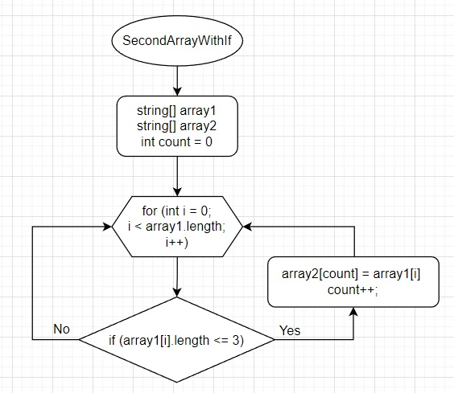

# Задача:
Написать программу, которая из имеющегося массива строк формирует массив из строк, длина которых меньше либо равна 3 символа. Первоначальный массив можно ввести с клавиатуры, либо задать на старте выполнения алгоритма. При решении не рекомендуется пользоваться коллекциями, лучше обойтись исключительно массивами.
# Решение:
В начале объявляется два массива: тот, который дан по условию задачи и второй такой же длины. Затем следует метод в котором цикл соразмерный длине массива. Внутри цикла происходит проверка условия ( <= 3 ), если условие выполняется то элемент первого массива заносится в "count" элемент второго массива. Переменная "count" нужна чтобы поочерёдно закидывать из первого массива во второй и чтобы в дальнейшем не было пробелов. После присвоения, переменная "count" увеличивается на 1 и возвращается к циклу "for" в котором "i" увеличивается на 1 и так проверяется до конца.
# Блок-схема используемого метода:
